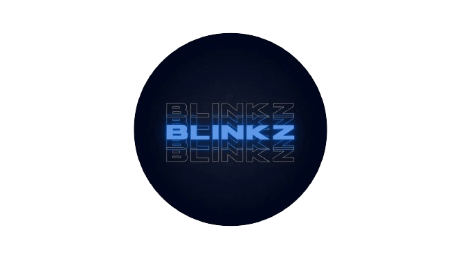

<a name="readme-top">

<br/>

<br />
<div align="center">
  <a href="https://github.com/notblinkzzz/">
  <!-- TODO: If you want to add logo or banner you can add it here -->
    
  </a>
<!-- TODO: Change Title to the name of the title of your Project -->
  <h3 align="center">WD-Seatwork-2</h3>
</div>
<!-- TODO: Make a short description -->
<div align="center">
 <!-- Short Description. (Optional)-->
</div>

<br />


---

<br />
<br />

<!-- TODO: If you want to add more layers for your readme -->
<details>
  <summary>Table of Contents</summary>
  <ol>
    <li>
      <a href="#overview">Overview</a>
      <ol>
        <li>
          <a href="#key-components">Key Components</a>
        </li>
        <li>
          <a href="#technology">Technology</a>
        </li>
      </ol>
    </li>
    <li>
      <a href="#rules-and-principles">Rules and Principles</a>
    </li>
    <li>
      <a href="#resources">Resources</a>
    </li>
  </ol>
</details>

---

## Overview

<!-- TODO: To be changed -->
<!-- The following are just sample -->
This is a multi-page, non-responsive website for a resume that has other features, such as contact forms, a side navigation bar, and more. It is made with numerous divs that act like a container that has columns and rows for every section, and within those containers, I can control how I want them to be displayed and such. The website has animations, hover/active effects, and skill bars.<br>
I based my website on an actual sample website I found on the internet. I used HTML and CSS to create this website. I also sourced some icons, effects, and other animations from YouTube or Google, but the website itself was created from scratch.<br>
This project took me almost 2 days to make, and while making it, I learned lots of new things.
<!-- Guiding Question:
- What is the project
- Whats the purpose
- What are key components
- What technology used and how it is used -->

### Key Components
- MultiPage Website
- Text Animation
- Social Icons Animation
- Hover and Active Effects
- Pagination
- Skill Bars
- Gradient Colors
- Contact Form
- Side navbar

### Technology


## Rules and Principles
1. Always use ***WD-*** in the front of the Title of the Project for the Subject followed by your custom naming.
2. Do not rename any .html files; always use 'index.html' as the filename.
3. File Structure to follow

```
WD-ProjectName
└─ assets
|   └─ css
|   |   └─ style.css
|   └─ img
|   |   └─ fileWith.jpeg/.jpg/.webp/.png
|   └─ js
|       └─ script.js
└─ pages
|  └─ pageName
|     └─ assets
|     |  └─ css
|     |  |  └─ style.css
|     |  └─ img
|     |  |  └─ fileWith.jpeg/.jpg/.webp/.png
|     |  └─ js
|     |     └─ script.js
|     └─ index.html
└─ index.html
└─ readme.md
```

## Resources

<!-- TODO: Add References -->
| Title | Purpose | Link |
|-|-|-|
| Reference Website | This is the site I based my website on. It looked really good and was fun to recreate from scratch. | https://lmpixels.com/demo/breezycv/dark/1/index.html#resume |
| Fonts | Have better looking fonts that makes the website look cleaner. | https://fonts.google.com/.
| Icons and logo | To have icons such as the home icon, contact icon, Facebook logo, Twitter logo, etc. | https://fontawesome.com/ |
| Instagram | Instagram logo with a gradient color. | https://codepad.co/snippet/instagram-icon-gradient-with-font-awesome |
| Background Image | Make the website look better. | https://unsplash.com/photos/blue-paint-splash-Lki74Jj7H-U |
| Skill Bar | Made the languages, and skills more pleasing to the eye. | https://www.w3schools.com/howto/howto_css_skill_bar.asp |
| Gradient Color for the skill bars | The gradient color is designed to visually represent the proficiency level of various skills in a way that is easily understandable. | https://cssgradient.io/ |
| Contact Form | To make the default input text look better. | https://www.youtube.com/watch?v=524ycUqs3f0&t=804s |
| Pagination | To have the ability to traverse the website. | https://www.youtube.com/watch?v=6ff96BkWqmg&t=196s |
| Home Page Animation | To have a simple animation of text | https://www.youtube.com/watch?v=Syg_9iB1vco |
| Hover Gif on Resume | When hovered on Work experience it hovers an image | https://tenor.com/view/crying-cat-sad-cat-me-when-i-dont-get-orod-tickets-gif-13399313231964052110 |
